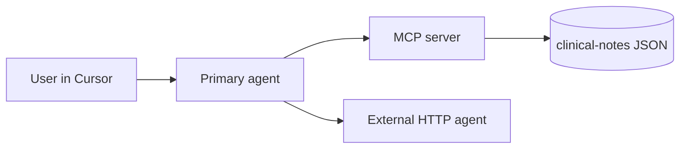

# Healthgent agent configuration reference

Authoritative configuration spec for the **primary agent** context: Cursor, MCP, optional scripts, and the external HTTP agent should all agree with this document. Operational runbook and workflows: [`kb-primary-agent.md`](kb-primary-agent.md).

---

## 1. Configuration overview

**Flow**

- **User** → Cursor chat / Composer → **Primary agent** (orchestrator).
- **Primary agent** → **MCP tools** (stdio) → reads **`clinical-notes/`** via `mcp-server` (deterministic file IO, validation, search, extract).
- **Primary agent** → optional **HTTP POST** → **external-agent** (structured report / heavier pass); external agent does **not** read the repo filesystem directly.



---

## 2. MCP server registration

Register the Healthgent MCP server in Cursor so it starts with **stdio** transport.

**Typical locations**

- **User-wide:** Cursor Settings → **MCP** → add server (UI copies or edits JSON depending on version).
- **Project:** Some setups support `.cursor/mcp.json` or merging into workspace settings — follow your Cursor version’s docs for “project MCP.”

**Example `mcpServers` entry** (adjust paths and command to match your machine and scaffold)

```json
{
  "mcpServers": {
    "healthgent-clinical-notes": {
      "command": "node",
      "args": ["/ABSOLUTE/PATH/TO/Healthgent/mcp-server/dist/index.js"],
      "cwd": "/ABSOLUTE/PATH/TO/Healthgent",
      "env": {
        "CLINICAL_NOTES_ROOT": "/ABSOLUTE/PATH/TO/Healthgent/clinical-notes"
      }
    }
  }
}
```

**Development variant** (if the package runs TypeScript directly):

```json
{
  "command": "npx",
  "args": ["tsx", "/ABSOLUTE/PATH/TO/Healthgent/mcp-server/src/index.ts"],
  "cwd": "/ABSOLUTE/PATH/TO/Healthgent",
  "env": {
    "CLINICAL_NOTES_ROOT": "/ABSOLUTE/PATH/TO/Healthgent/clinical-notes"
  }
}
```

**Requirements**

- **`cwd`:** Workspace root (or the root that contains `clinical-notes/`).
- **`CLINICAL_NOTES_ROOT`:** Absolute path to the `clinical-notes` directory so tools do not depend on ambiguous relative cwd.

---

## 3. Environment variables

| Variable | Required? | Default | Consumed by | Example |
|----------|-----------|---------|-------------|---------|
| `CLINICAL_NOTES_ROOT` | **Yes** for MCP | — | `mcp-server` | `/Users/you/Healthgent/clinical-notes` |
| `EXTERNAL_AGENT_URL` | Recommended when using HTTP delegation | `http://127.0.0.1:8788` | Primary agent (human/docs); optional helper scripts | `http://127.0.0.1:8788` |
| `EXTERNAL_AGENT_API_KEY` | If external agent enforces auth | unset | `external-agent` (verify); scripts | `dev-shared-secret` |
| `OPENAI_API_KEY` / provider key | Only if external agent calls a cloud model | unset | `external-agent` | `(set locally, never commit)` |

After scaffold, add any missing rows from `mcp-server/.env.example` and `external-agent/.env.example` here so this table stays canonical.

---

## 4. External agent URL and auth

| Aspect | Value |
|--------|--------|
| **Dev base URL** | Prefer `http://127.0.0.1:8788` or the port defined in `external-agent` — keep **one** agreed default across README and this doc. |
| **Primary path** | **POST** `/analyze` (or `/report` if named that way in code — align KB §9 with actual route). |
| **Auth** | Optional hackathon header, e.g. `Authorization: Bearer <EXTERNAL_AGENT_API_KEY>` — only if implemented; otherwise omit for local demo. |
| **Prod placeholder** | Not in scope; if demonstrated, use a separate env profile and never commit keys. |

---

## 5. Routing policy for the primary agent

**MUST use MCP** for:

- Listing, loading, validating, searching, or extracting from files under `clinical-notes/`.
- Any operation that requires knowing exact filenames, schema checks, or deterministic excerpts.

**MUST use external HTTP agent** for:

- Requesting a **structured report** (`findings`, `gaps`, `suggested_followups`) when you want a separate process, optional cloud model, or clear boundary for judges — **after** MCP has supplied the note payload.

**Ordering (recommended)**

1. **`list_clinical_notes`** (if id unknown) → **`get_clinical_note`**.
2. **`validate_clinical_note`** before high-stakes summarization or POST to external agent.
3. **`search_notes`** / **`extract_section`** as needed to save tokens.
4. **External POST** only with validated or explicitly scoped JSON.

Avoid ad-hoc path guessing in free text; prefer tool arguments.

---

## 6. Cursor rules mapping

| Policy | Intended rule file | Contents |
|--------|-------------------|----------|
| MCP-first file access; no phantom paths | `.cursor/rules/healthgent-mcp.mdc` | Always use MCP tools for `clinical-notes/`; validate before synthesis. |
| External agent delegation | `.cursor/rules/healthgent-external-agent.mdc` | When to POST; URL from env; timeouts; non-diagnostic framing. |
| Safety / demo scope | `.cursor/rules/healthgent-safety.mdc` | Synthetic data only; educational outputs; no prod EHR claims. |
| Reply validation / grounding | `.cursor/rules/healthgent-validation.mdc` | Mandatory checklist before fixture-grounded answers — canonical detail in [`agent-validation-guardrails.md`](agent-validation-guardrails.md). |

Until those files exist, capture the same policies in chat or add rules when executing the “wire primary agent” milestone.

---

## 7. Optional: prompts / templates

Version-controlled snippets may live under:

- `.cursor/prompts/` or `docs/prompts/` — **only if you add them**; keep paths stable and reference them here.

Example filenames:

- `visit-summary-demo.md` — non-diagnostic stakeholder summary template.
- `structured-report-request.md` — body outline for external agent calls.

---

## 8. Secrets handling

- **Never commit** `.env`, API keys, or tokens.
- **Hackathon demo:** Keys live in local `.env`, Cursor-safe env (if used), or a secrets manager outside git — rotate any key accidentally pasted into chat.
- **MCP process:** Prefer passing only `CLINICAL_NOTES_ROOT` to MCP; keep LLM keys in `external-agent` if possible so MCP stays minimal.

---

## Related

- [`kb-primary-agent.md`](kb-primary-agent.md) — setup, workflows, tool catalog, troubleshooting.
